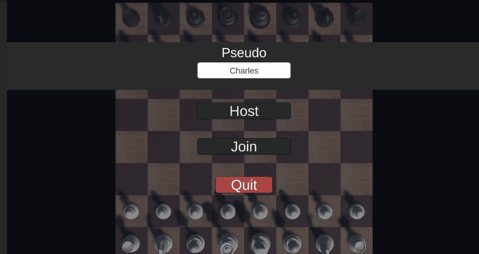

# Multichess - Unity/C#
## ISART DIGITAL : School Project - GP2 - Noé MOUCHEL - Rémi GINER


<!-- ABOUT THE PROJECT -->
# About The Project 
**Built with Unity 2021.3.5f1**

The goal of the project is to create a local network multiplayer mode for a given chess game. The program must be able to manage the connection and the exchange of network packets between a client-server (listen server) and at least one other client.

## Preview
<div style="text-align:center">


**Host view**


**Client view**
</div>

# Features & Usage

## Controls
The controls are made for mouse + keyboard:
- ESPACE - Pause
- Press left click - Select a piece
- Mouse drag - Move a piece to a chess slot
- Release left click - Lay a piece

## Features

- Party hosting/joining/spectating
- Chat system

# Details


## How does the network system work ?

To implement easily the online features using TPC protocoles, we decided to use a packet emission/listening system. By serializing the data we want to send into a `packet` class, we are able to know what type of data any `TCP stream` (server and client) is reading.

### In Packet.cs
```cs 
[Serializable]
public class PacketHeader
{
    public EPacketType type = EPacketType.UNDEFINED; // "Gameplay" type of data we sent
    public int size = 0; // Size of the data we sent 
}

[Serializable]
public class Packet
{
    public PacketHeader header = new PacketHeader();
    public byte[] datas; // Serialized data we want to send in the stream
}

public enum EPacketType // All different "gameplay" types
{
    UNDEFINED,
    MOVEMENTS,
    SPECTATORS_MOVEMENTS,
    MOVE_VALIDITY,
    UNITY_MESSAGE,  // Use to mimic function calls from the server to a client (Or vice versa)
    CHAT_MESSAGE,
    TEAM_SWITCH,
    TEAM_INFO,
    TEAM_TURN
}
```

Using a packet system we can easily emit any type of data we want. By splitting the packet implementation into two parts (A PacketHeader and its data) we are able to read a packet into two times 

### In Host.cs/Client.cs
```cs
// Listener functions are asynchronous to avoid completely blocking the runtime
public async void Listen[...]()
{
    ...

    // We know what size a PacketHeader do, so the first time we can read blindly in the stream 
    int headerSize = Packet.PacketSize();
    byte[] headerBytes = new byte[headerSize];

    [...]

    // Firstly we read the header informations -> its data type and data size
    await [stream].ReadAsync(headerBytes);

    // Then we can create a packet to fill with future data
    Packet packet = Packet.DeserializeHeader(headerBytes);

    // We will the precedent packets with the data
    packet.datas = new byte[packet.header.size];
    await [stream].ReadAsync(packet.datas);

    // Then we let the script intepret it
    InterpretPacket(packet);

    ...
}
```

The intepretation of a packet is different for each type of player we have (host, current player, spectator). We decided to use basic inheritance to interpret the packets depending on the case. But there is some common intepretations of the packets.

In this case, if the packet is a UNITY_MESSAGE, the packet sender is able to call a function from another computer using the [Unity message system](https://docs.unity3d.com/ScriptReference/Component.SendMessage.html):

### In NetworkUser.cs
```cs
 protected virtual void InterpretPacket(Packet toInterpret)
    {
        switch (toInterpret.header.type)
        {
            [...]

            case EPacketType.UNITY_MESSAGE:
                ExecuteUnityMessage(toInterpret); // -> Component.SendMessage(toInterpret.FillObject<string>());

                break;

            [...]
        }
    }
```

## How does the game work ?
The way the game works is relatively simple, when the host plays, it sends its movement to each TCPClient.
When the other player plays, he sends his move to the host only. When the move is validated by the server, the player receives a confirmation of his move, and the spectators receive the player's move. The team turn system is also managed by the server.

### In ChessGameMgr.cs
```cs
public void PlayTurn(Move move)
{
    if (m_player.isHost)
    {
        if (!TryMove(move))
            UpdatePieces();
    }
    else
    {
        // The client player sends its movement
        m_player.networkUser.SendPacket(EPacketType.MOVEMENTS, move);
    }
}

// Used when the server receive a move
public void CheckMove(Move move)
{
    bool isValid = boardState.IsValidMove(teamTurn, move);
    m_player.networkUser.SendPacket(EPacketType.MOVE_VALIDITY, isValid);

    if (!isValid) return;

    [...]

    m_player.networkUser.SendPacket(EPacketType.TEAM_TURN, teamTurn);

    m_player.networkUser.SendPacket(EPacketType.SPECTATORS_MOVEMENTS, move);
}

// Used when the server do a move
public bool TryMove(Move move)
{
    bool isValid = boardState.IsValidMove(teamTurn, move);

    if (!isValid)
        return false;

    m_player.networkUser.SendPacket(EPacketType.MOVEMENTS, move);

    [...]

    m_player.networkUser.SendPacket(EPacketType.TEAM_TURN, teamTurn);

    return true;
}

```

The movement system uses a DeltaCompression-like system, the server never sends the entire board state.

## Assets:
Given with the template project

## Versionning
We used Git Lab for the versioning.

## Authors
**Noé MOUCHEL**
**Rémi GINER**
